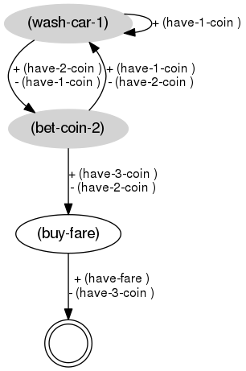
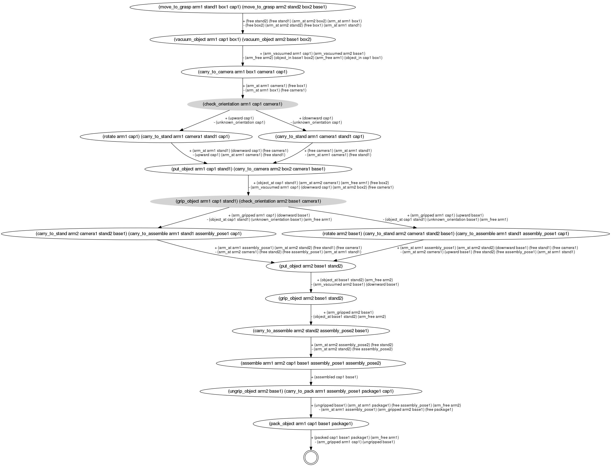

# Safe-Planner - a Non-Deterministic Planner by Compilation into Classical Problems

**Safe-Planner (SP)** is an off-line non-deterministic planning algorithm based on replanning which compiles a **Fully Observable Non-Deterministic (FOND)** planning problem into a set of classical planning problems which can be solved using a classical problem solver. SP then merges the obtained classical solutions and forms a non-deterministic solution policy to the original non-deterministic problem. SP avoids dead-end states by simulating the execution during the policy generation and therefore it generates safe policies. The execution of a safe policy is guaranteed to terminate in a goal state for all potential outcomes of the actions in the non-deterministic environment (if any exists).

SP can employ any off-the-shelf classical planner for problem solving. Currently, the classical planners [FF], [OPTIC], [MADAGASCAR], [VHPOP], and [LPG-TD] have been integrated. 

**Note:** OPTIC, MADAGASCAR, VHPOP, and LPG-TD are termporal/partial-order planners and therefore the produced policies are also partial-order policies.

[FF]: https://fai.cs.uni-saarland.de/hoffmann/ff.html
[OPTIC]: https://nms.kcl.ac.uk/planning/software/optic.html
[MADAGASCAR]: https://users.aalto.fi/~rintanj1/jussi/satplan.html
[VHPOP]: http://www.tempastic.org/vhpop/
[LPG-TD]: https://lpg.unibs.it/lpg/


## Requirement

SP has been implemented in `Python` and the following packages are required to install: 

```
sudo apt install python-pip
pip install ply graphviz
```


Also install the following `Lua` libraries:

```
sudo apt install -y lua-penlight lua-json luarocks lua-ansicolors libgv-lua
sudo luarocks install ansicolors graphviz
```


## PPDDL

Safe-Planner uses the **Probabilistic Planning Domain Definition Language (PPDDL)** as the domain modeling language with ``oneof`` clauses in actions' effects. PPDDL is an extension of the standard PDDL to support probabilistic or non-deterministic outcomes in the actions' descriptions. A description of PPDDL is available at http://reports-archive.adm.cs.cmu.edu/anon/2004/CMU-CS-04-167.pdf. 

A helpful collection of materials for AI Planning and PDDL are also provided at https://planning.wiki.

A useful introduction to learning PDDL is also available at https://fareskalaboud.github.io/LearnPDDL.

#### PDDL supported

Safe-Planner is strongly dependent on the employed external classical planner, so the given planning domains and problems are firstly required to be supported by the external classical planners.
Apart from the PDDL support of the external planners, Safe-Planner also supports limited but most useful features of the PDDL. Particularly, Safe-Planner supports the following PDDL requirements: `:strips`, `:typing`, `:equality`, `:negative-preconditions`, `:existential-preconditions`, `:universal-preconditions`, `:conditional-effects`, `:probabilistic-effects`.

More precisely, the following combinations are supported by Safe-Planner for modeling action effects:

##### conditional effects

```(when (conditions) (effects))```

```(forall (variables list) (effects))```

```(forall (variables list) (when (conditions) (effects)))```

##### non-deterministic effects

```
(oneof (effects)
       (when (conditions) (effects))
       (forall (variables list) (effects))
       (forall (variables list) (when (conditions) (effects)))
       ...)
```

```
(probabilistic P (effects)
               P (when (conditions) (effects))
               P (forall (variables list) (effects))
               P (forall (variables list) (when (conditions) (effects)))
               ...)
```


**Note:** currently, Safe-Planner does not support **untyped** objects, so when modeling a planning domain always use a type for objects.


## Usage

```
python3 main.py <DOMAIN> <PROBLEM> [-c <PLANNER>] [-d]
```

For example, the following commands run Safe-Planner using classical planners FF, OPTIC and MADAGASCAR to solve a [`pickit`](domains/picki) problem:

```
python3 main.py domains/pickit/domain.pddl domains/pickit/prob0.pddl -c ff
```

```
python3 main.py domains/pickit/domain.pddl domains/pickit/prob0.pddl -c lpg-td
```

```
python3 main.py domains/pickit/domain.pddl domains/pickit/prob0.pddl -c optic-clp
```


## The planner's output

- The output plan is a sequence of steps (i.e., each step may contain more than one action). 
- The numbers represent the order of the execution of the steps. 
- Steps in each line is followed by some conditions under which the next step is chosen. 
- Empty conditions are true conditions and only appear for deterministic actions/steps. 
- Steps containing nondeterministic actions have more than one conditions. 
- Conditions are the different possible outcomes of that nondeterministic step. 
- Conditions include a tuple of _add_list_ of that step, that is, the effects added to a new state.
- The number after each condition represents the next step for the execution.


##### Example 1: [`bus-fare`](benchmarks/prob_interesting/bus-fare) domain


```
$ python main.py benchmarks/prob_interesting/bus-fare.pddl -j -d

@ PLAN
 0 : (wash-car-1) -- ((have-1-coin )) 0 -- ((have-2-coin )) 1
 1 : (bet-coin-2) -- ((have-1-coin )) 0 -- ((have-3-coin )) 2
 2 : (buy-fare) -- () GOAL
```

the optional parameter `-d` translates the produced plan into a dot file in the same path:



[**EXPERIMENTAL!**] the optional parameter `-j` translates the produced plan into a json file in the same path:

```
{
    "plan": [
        "step_0", 
        "step_1", 
        "step_2"
    ],
    "step_0": {
        "actions": [
            {"name": "wash-car-1", "arguments": []}
        ],
        "outcomes": [
            {"next": "step_1", "condition": ["(have-2-coin )"]}, 
            {"next": "step_0", "condition": ["(have-1-coin )"]}
        ]
    },
    "step_1": {
        "actions": [{"name": "bet-coin-2", "arguments": []}
        ],
        "outcomes": [
            {"next": "step_0", "condition": ["(have-1-coin )"]},
            {"next": "step_2", "condition": ["(have-3-coin )"]}
        ]
    },
    "step_2": {
        "actions": [
            {"name": "buy-fare", "arguments": []}
        ],
        "outcomes": [
            {"next": "GOAL", "condition": ["(have-fare )"]}
        ]
    }
}
```

##### Example 2: [`pickit`](domains/picki) domain

```
$ python3 main.py domains/pickit/domain.pddl domains/pickit/prob0.pddl -c lpg-td -d -j

@ PLAN
 0 : (move_to_grasp arm1 stand1 box1 cap1) (move_to_grasp arm2 stand2 box2 base1) -- () 1
 1 : (vacuum_object arm1 cap1 box1) (vacuum_object arm2 base1 box2) -- () 2
 2 : (carry_to_camera arm1 box1 camera1 cap1) -- () 3
 3 : (check_orientation arm1 cap1 camera1) -- ((downward cap1)) 4 -- ((upward cap1)) 5
 4 : (carry_to_stand arm1 camera1 stand1 cap1) -- () 6
 5 : (rotate arm1 cap1) (carry_to_stand arm1 camera1 stand1 cap1) -- () 6
 6 : (put_object arm1 cap1 stand1) (carry_to_camera arm2 box2 camera1 base1) -- () 7
 7 : (grip_object arm1 cap1 stand1) (check_orientation arm2 base1 camera1) -- ((arm_gripped arm1 cap1) (upward base1)) 8 -- ((arm_gripped arm1 cap1) (downward base1)) 9
 8 : (rotate arm2 base1) (carry_to_stand arm2 camera1 stand2 base1) (carry_to_assemble arm1 stand1 assembly_pose1 cap1) -- () 10
 9 : (carry_to_stand arm2 camera1 stand2 base1) (carry_to_assemble arm1 stand1 assembly_pose1 cap1) -- () 10
10 : (put_object arm2 base1 stand2) -- () 11
11 : (grip_object arm2 base1 stand2) -- () 12
12 : (carry_to_assemble arm2 stand2 assembly_pose2 base1) -- () 13
13 : (assemble arm1 arm2 cap1 base1 assembly_pose1 assembly_pose2) -- () 14
14 : (ungrip_object arm2 base1) (carry_to_pack arm1 assembly_pose1 package1 cap1) -- () 15
15 : (pack_object arm1 cap1 base1 package1) -- () GOAL
```

the optional parameter `-d` translates the produced plan into a dot file in the same path:



[**EXPERIMENTAL!**] the optional parameter `-j` translates the produced plan into a json file in the same path:

```
{
    "plan": [
        "step_0",
        "step_1",
        "step_2",
        "step_3",
        "step_4",
        "step_5",
        "step_6",
        "step_7",
        "step_8",
        "step_9",
        "step_10",
        "step_11",
        "step_12",
        "step_13",
        "step_14",
        "step_15"
    ],
    "step_0": {
        "actions": [
            {"name": "move_to_grasp","arguments": ["arm1","stand1","box1","cap1"]},
            {"name": "move_to_grasp","arguments": ["arm2","stand2","box2","base1"]}
        ],
        "outcomes": [
            {
                "condition": ["(free stand2)","(free stand1)","(arm_at arm2 box2)","(arm_at arm1 box1)" ],
                "next": "step_1"
            }
        ]
    },
    "step_1": {
        "actions": [
            {"name": "vacuum_object","arguments": ["arm1","cap1","box1"]},
            {"name": "vacuum_object","arguments": ["arm2","base1","box2"]}
        ],
        "outcomes": [
            {
                "condition": ["(arm_vacuumed arm1 cap1)","(arm_vacuumed arm2 base1)"],
                "next": "step_2"
            }
        ]
    },
    "step_2": {
        "actions": [
            {"name": "carry_to_camera","arguments": ["arm1","box1","camera1","cap1"]}
        ],
        "outcomes": [
            {
                "condition": ["(arm_at arm1 camera1)","(free box1)"],
                "next": "step_3"
            }
        ]
    },
    "step_3": {
        "actions": [
            {"name": "check_orientation","arguments": ["arm1","cap1","camera1"]}
        ],
        "outcomes": [
            {
                "condition": ["(upward cap1)"],
                "next": "step_4"}
                ,
            {
                "condition": ["(downward cap1)"],
                "next": "step_5"
            }
        ]
    },
    "step_4": {
        "actions": [
            {"name": "rotate","arguments": ["arm1","cap1"]},
            {"name": "carry_to_stand","arguments": ["arm1","camera1","stand1","cap1"]}
        ],
        "outcomes": [
            {
                "condition": ["(arm_at arm1 stand1)","(downward cap1)","(free camera1)"],
                "next": "step_6"
            }
        ]
    },
    "step_5": {
        "actions": [
            {"name": "carry_to_stand","arguments": ["arm1","camera1","stand1","cap1"]}
        ],
        "outcomes": [{
            "condition": ["(free camera1)","(arm_at arm1 stand1)"],
            "next": "step_6"
        }
        ]
    },
    "step_6": {
        "actions": [
            {"name": "put_object","arguments": ["arm1","cap1","stand1"]},
            {"name": "carry_to_camera","arguments": ["arm2","box2","camera1","base1"]}
        ],
        "outcomes": [
            {
                "condition": ["(object_at cap1 stand1)","(arm_at arm2 camera1)","(arm_free arm1)","(free box2)"],
                "next": "step_7"
            }
        ]
    },
    "step_7": {
        "actions": [
            {"name": "grip_object","arguments": ["arm1","cap1","stand1"]},
            {"name": "check_orientation","arguments": ["arm2","base1","camera1"]}
        ],
        "outcomes": [
            {
                "condition": ["(arm_gripped arm1 cap1)","(downward base1)"],
                "next": "step_8"}
                ,
            {
                "condition": ["(arm_gripped arm1 cap1)","(upward base1)"],
                "next": "step_9"
            }
        ]
    },
    "step_8": {
        "actions": [
            {"name": "carry_to_stand","arguments": ["arm2","camera1","stand2","base1"]},
            {"name": "carry_to_assemble","arguments": ["arm1","stand1","assembly_pose1","cap1"]}
        ],
        "outcomes": [
            {
                "condition": ["(arm_at arm1 assembly_pose1)","(arm_at arm2 stand2)","(free stand1)","(free camera1)"],
                "next": "step_10"
            }
        ]
    },
    "step_9": {
        "actions": [
            {"name": "rotate","arguments": ["arm2","base1"]},
            {"name": "carry_to_stand","arguments": ["arm2","camera1","stand2","base1"]},
            {"name": "carry_to_assemble","arguments": ["arm1","stand1","assembly_pose1","cap1"]}
        ],
        "outcomes": [
            {
                "condition": ["(arm_at arm1 assembly_pose1)","(arm_at arm2 stand2)","(downward base1)","(free stand1)","(free camera1)"],
                "next": "step_10"
            }
        ]
    },
    "step_10": {
        "actions": [
            {"name": "put_object","arguments": ["arm2","base1","stand2"]}
        ],
        "outcomes": [
            {
                "condition": ["(object_at base1 stand2)","(arm_free arm2)"],
                "next": "step_11"
            }
        ]
    },
    "step_11": {
        "actions": [
            {"name": "grip_object","arguments": ["arm2","base1","stand2"]}
        ],
        "outcomes": [
            {
                "condition": ["(arm_gripped arm2 base1)"],
                "next": "step_12"
            }
        ]
    },
    "step_12": {
        "actions": [
            {"name": "carry_to_assemble","arguments": ["arm2","stand2","assembly_pose2","base1"]}
        ],
        "outcomes": [
            {
                "condition": ["(arm_at arm2 assembly_pose2)","(free stand2)"],
                "next": "step_13"
            }
        ]
    },
    "step_13": {
        "actions": [
            {"name": "assemble","arguments": ["arm1","arm2","cap1","base1","assembly_pose1","assembly_pose2"]}
        ],
        "outcomes": [
            {
                "condition": ["(assembled cap1 base1)"],
                "next": "step_14"
            }
        ]
    },
    "step_14": {
        "actions": [
            {"name": "ungrip_object","arguments": ["arm2","base1"]},
            {"name": "carry_to_pack","arguments": ["arm1","assembly_pose1","package1","cap1"]}
        ],
        "outcomes": [
            {
                "condition": ["(ungripped base1)","(arm_at arm1 package1)","(free assembly_pose1)","(arm_free arm2)"],
                "next": "step_15"
            }
        ]
    },
    "step_15": {
        "actions": [
            {"name": "pack_object","arguments": ["arm1","cap1","base1","package1"]}
        ],
        "outcomes": [
            {
                "condition": ["(packed cap1 base1 package1)","(arm_free arm1)"],
                "next": "GOAL"
            }
        ]
    }
}
```
